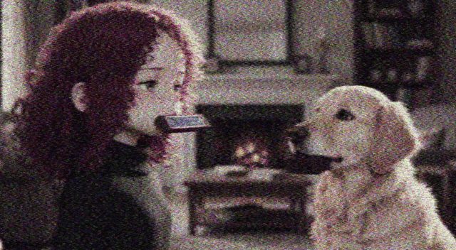
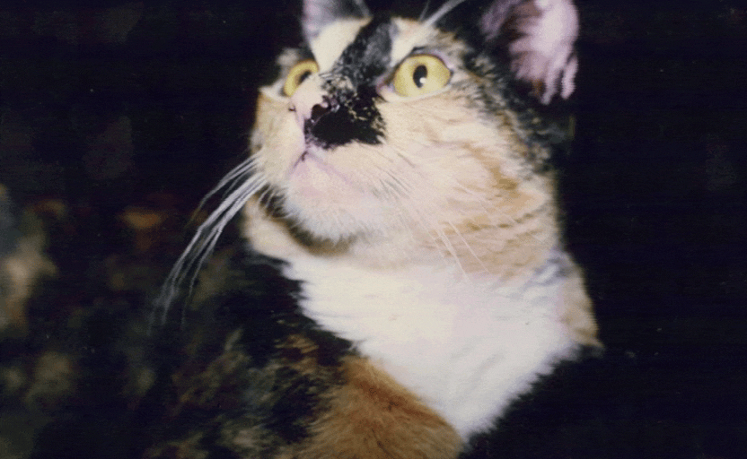

# Video Effects Scripts (2022)

analog broadcast effect (broadcast_effect.py):

video audio oscillation effect (video_oscillator.py):

video low pass filter effect (video_lpf.py):

These scripts were coded during a time I was heavily into video synthesis, and because there wasn't really anything better to do during the pandemic era when these were written.

The code has been slightly updated to fix some bugs.

WARNING: These scripts are slow.
